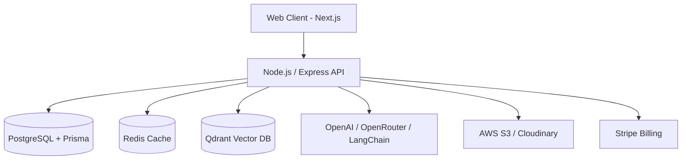

# AgentFlow 🤖⚡

**The Ultimate AI-Powered Business Automation Platform**

AgentFlow is an enterprise-grade AI automation platform that unifies Large Language Models (LLMs), Retrieval-Augmented Generation (RAG), and Multi-Agent Workflows to streamline customer support, knowledge management, lead handling, and internal business operations. 


---

## 🌟 Key Features

- **Multi-Agent Workflow Engine:** Visually design and automate pipelines where specialized agents (Manager, Research, Writer, Reviewer) collaborate to solve complex tasks.
- **RAG-Powered Knowledge Base:** Upload PDFs, DOCXs, and TXTs to build an embedded vector database for accurate, context-aware AI responses.
- **Dynamic Tool Calling:** Native integrations for external tools including Weather, Email generation, CRM sync, and internal Databases.
- **Organization & Role Management:** Super Admin, Organization Owner, and Team Member roles for secure, scalable multi-tenant deployments.
- **Analytics & Billing:** Built-in Stripe subscription management (Free, Pro, Enterprise) with resource limits and usage metrics.

---

## 🏗️ System Architecture & Design

AgentFlow utilizes a highly scalable, decoupled monorepo architecture designed for performance and maintainability.

### High-Level Architecture



### Tech Stack

- **Frontend:** Next.js (TypeScript), Tailwind CSS, ShadCN UI, Redux Toolkit, React Flow (for visual workflow builder).
- **Backend:** Node.js, Express.js, TypeScript.
- **Database & ORM:** PostgreSQL, Prisma ORM.
- **AI Infrastructure:** OpenAI API, OpenRouter API, LangChain, LangGraph.
- **Vector Search:** Qdrant.
- **Infrastructure:** Redis (Caching), JWT (Auth), AWS S3/Cloudinary (Storage), Stripe (Payments).

---

## 🚀 Getting Started

### Prerequisites

- Node.js (v18+)
- pnpm (v8+)
- PostgreSQL
- Redis
- Qdrant Vector Database

### 1. Clone the repository

```bash
git clone https://github.com/your-org/agent-flow.git
cd agent-flow
```

### 2. Install dependencies

```bash
pnpm install
```


### 4. Database Setup

```bash
pnpm --filter @agentflow/database prisma generate
pnpm --filter @agentflow/database prisma db push
```

### 5. Run the Application (Development)

Start the entire monorepo in development mode:

```bash
pnpm dev
```
- **Web App:** http://localhost:3000
- **API Server:** http://localhost:5000

### 6. Production Build

To compile the TypeScript backend and optimize the Next.js frontend for production:

```bash
pnpm build
pnpm start
```

---

## 🛡️ Security Best Practices

- **Authentication:** Stateless JWT-based authentication with strict role-based access control (RBAC).
- **Rate Limiting:** Protects AI endpoints from abuse and prevents API cost overruns.
- **Data Isolation:** Organization ID scoping across all database queries ensures strict multi-tenant data isolation and privacy.
- **Password Hashing:** Robust Bcrypt hashing for all user credentials.

---

## 📜 License

This project is licensed under the MIT License. See the [LICENSE](LICENSE) file for details.
