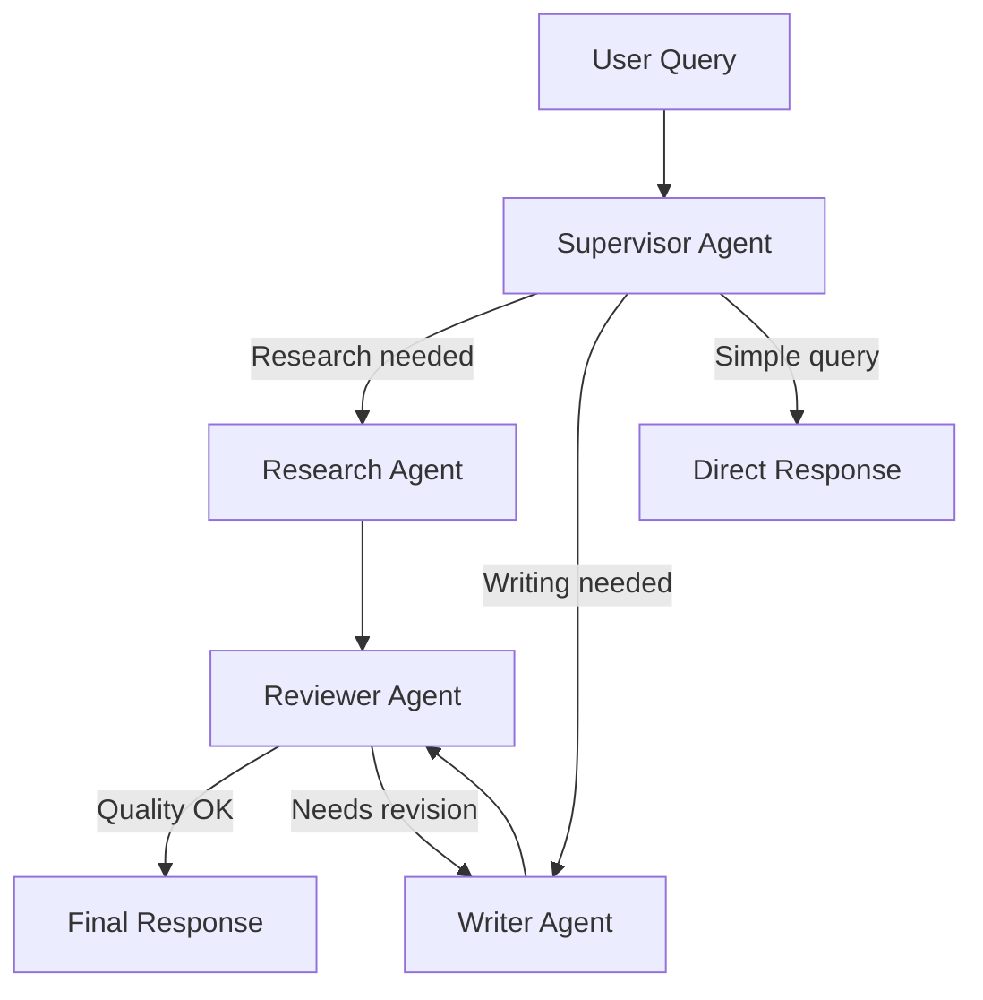

# AgentFlow — AI Business Automation Platform

> Full-stack AI platform: LLM chat, RAG, tool calling, multi-agent workflows, analytics & billing.

---

## User Review Required

> [!IMPORTANT]
> **This is a massive project.** It's broken into 8 sequential phases. Each phase is independently deployable. I recommend we build & test phase-by-phase rather than all at once.

> [!WARNING]
> **API Keys Required:** You'll need keys for OpenAI/OpenRouter, Qdrant Cloud (or Docker), Stripe, Google OAuth, AWS S3/Cloudinary, and a PostgreSQL database before we start Phase 3+.

---

## Open Questions

1. **Deployment target?** Ubuntu VPS from the start, or local Docker Compose for development first?
2. **OpenAI vs OpenRouter?** Which LLM provider do you want as primary? (PRD lists both)
3. **Qdrant Cloud or Self-hosted?** Cloud is easier, self-hosted via Docker is cheaper.
4. **Stripe Test Mode?** Should we start with Stripe test keys for billing?
5. **Domain name?** Do you have a domain ready for production deployment?

---

## Architecture Overview

```
agentflow/
├── apps/
│   ├── web/                    # Next.js 15 (App Router) frontend
│   └── api/                    # Express.js + TypeScript backend
├── packages/
│   ├── database/               # Prisma schema, client, migrations
│   ├── shared/                 # Zod schemas, types, constants
│   └── ui/                     # Shared ShadCN components (optional)
├── docker/                     # Docker Compose configs
├── turbo.json                  # Turborepo pipeline
├── pnpm-workspace.yaml
└── package.json
```

---

## Phase 1: Monorepo Foundation & Dev Environment

### Goal
Set up the entire project scaffold with Turborepo + pnpm, TypeScript configs, linting, and Docker Compose for local services.

### [NEW] Root Configuration Files
- `package.json` — Root workspace config
- `pnpm-workspace.yaml` — Workspace definitions
- `turbo.json` — Build/dev pipeline with caching
- `.gitignore`, `.prettierrc`, `.eslintrc.js`
- `docker-compose.yml` — PostgreSQL + Redis + Qdrant containers

### [NEW] `packages/database/`
- `schema.prisma` — Full database schema (all 11 entities from PRD)
- `index.ts` — Export PrismaClient singleton
- `seed.ts` — Seed script for dev data

#### Database Schema (Core Entities)
| Entity | Key Fields |
|---|---|
| User | id, email, password, name, role, emailVerified, avatar |
| Organization | id, name, slug, ownerId, plan, settings |
| Team | id, orgId, name |
| TeamMember | id, teamId, userId, role |
| Document | id, orgId, name, type, url, status, metadata |
| Embedding | id, documentId, content, vectorId, metadata |
| Conversation | id, orgId, userId, title, agentType |
| Message | id, conversationId, role, content, tokens, toolCalls |
| Lead | id, orgId, name, email, phone, status, source |
| Subscription | id, orgId, plan, status, stripeId, currentPeriodEnd |
| Payment | id, subscriptionId, amount, currency, status |
| UsageRecord | id, orgId, type, count, month |

### [NEW] `packages/shared/`
- Zod validation schemas shared between frontend & backend
- TypeScript types/interfaces
- Constants (roles, plans, limits)

### [NEW] `apps/api/` — Express Scaffold
- `src/index.ts` — Server entry with middleware setup
- `src/config/` — Environment config, database connection
- `src/middleware/` — Error handler, auth, rate limiter, validation

### [NEW] `apps/web/` — Next.js Scaffold
- Initialize via `npx create-next-app` with App Router, TypeScript, Tailwind, ESLint
- Base layout with dark mode support
- ShadCN UI initialization

### Verification
- `pnpm install` succeeds
- `pnpm dev` starts both apps concurrently
- `docker compose up` starts PostgreSQL + Redis + Qdrant
- `pnpm db:migrate` runs Prisma migrations successfully

---

## Phase 2: Authentication & Authorization

### Goal
Complete auth system with JWT, Google OAuth, email verification, and RBAC.

### Backend (`apps/api/`)

#### [NEW] `src/modules/auth/`
- `auth.controller.ts` — Register, login, logout, refresh, forgot/reset password
- `auth.service.ts` — Business logic, password hashing (bcrypt), JWT (access + refresh tokens)
- `auth.routes.ts` — Route definitions
- `auth.validator.ts` — Zod request validation

#### [NEW] `src/modules/user/`
- `user.controller.ts` — Get profile, update profile, upload avatar
- `user.service.ts` — User CRUD operations

#### [NEW] `src/middleware/auth.middleware.ts`
- JWT verification middleware
- Role-based guard (`requireRole('SUPER_ADMIN')`)

#### [NEW] `src/lib/`
- `jwt.ts` — Token generation/verification helpers
- `email.ts` — Email service (Nodemailer) for verification & password reset
- `google-oauth.ts` — Google OAuth flow

### Frontend (`apps/web/`)

#### [NEW] Auth Pages
- `/login` — Email/password + Google OAuth button
- `/register` — Registration form with email verification
- `/forgot-password` & `/reset-password`
- `/verify-email/[token]`

#### [NEW] State Management
- Redux Toolkit store setup
- Auth slice (user state, tokens, login/logout actions)
- RTK Query API slices for auth endpoints
- Axios interceptor for token refresh

### Verification
- Register → receive verification email → verify → login flow works
- Google OAuth login works
- Protected routes redirect unauthenticated users
- Role-based access control blocks unauthorized actions

---

## Phase 3: Workspace & Organization Management

### Goal
Multi-tenant workspace system where org owners manage teams and settings.

### Backend

#### [NEW] `src/modules/organization/`
- CRUD for organizations
- Settings management (name, logo, timezone)
- Organization switching for users in multiple orgs

#### [NEW] `src/modules/team/`
- Create teams, invite members (email invitations)
- Accept/reject invitations
- Assign/update member roles
- Remove members

### Frontend

#### [NEW] Dashboard Layout
- Sidebar navigation (collapsible)
- Top header with org switcher, user menu, notifications
- Breadcrumb navigation

#### [NEW] Pages
- `/dashboard` — Overview with quick stats
- `/dashboard/settings` — Org settings (name, logo, plan info)
- `/dashboard/team` — Team management (invite, roles, remove)
- `/dashboard/team/invite` — Invitation flow

### Verification
- Create organization → invite team member → accept invite flow works
- Role-based UI elements show/hide correctly
- Organization switcher works for multi-org users

---

## Phase 4: Knowledge Base & RAG System

### Goal
Document upload → text extraction → chunking → embeddings → Qdrant vector storage → RAG-powered Q&A.

### Backend

#### [NEW] `src/modules/document/`
- `document.controller.ts` — Upload, list, delete documents
- `document.service.ts` — File processing orchestration
- `document.processor.ts` — PDF/DOCX/TXT text extraction (pdf-parse, mammoth)

#### [NEW] `src/modules/rag/`
- `chunker.ts` — Semantic text chunking (RecursiveCharacterTextSplitter from LangChain)
- `embedder.ts` — OpenAI embeddings generation
- `vector-store.ts` — Qdrant client (create collection, upsert, search)
- `rag.service.ts` — Full RAG pipeline: query → vector search → context assembly → LLM response
- `rag.controller.ts` — RAG query endpoint

#### Pipeline Flow
```
Upload → Extract Text → Chunk (500 tokens, 50 overlap)
       → Generate Embeddings (OpenAI ada-002)
       → Store in Qdrant (with metadata filtering by orgId)

Query → Embed Query → Vector Search (top-5)
      → Assemble Context → LLM Prompt → Response
```

### Frontend

#### [NEW] Knowledge Base Pages
- `/dashboard/knowledge` — Document list with status indicators
- `/dashboard/knowledge/upload` — Drag & drop upload with progress
- Document processing status (pending → processing → ready → error)

### Verification
- Upload PDF → text extracted → chunks stored in Qdrant
- Ask question → relevant chunks retrieved → accurate LLM response
- Multi-tenant isolation (org A can't access org B's documents)

---

## Phase 5: AI Chat Assistant & Tool Calling

### Goal
Real-time AI chat with conversation memory, streaming responses, and external tool integration.

### Backend

#### [NEW] `src/modules/chat/`
- `chat.controller.ts` — Create conversation, send message, list conversations
- `chat.service.ts` — LLM orchestration with LangChain
- `chat.streaming.ts` — SSE streaming for real-time token delivery
- `memory.service.ts` — Conversation history management (Redis cache + DB persistence)

#### [NEW] `src/modules/tools/`
- `tool.registry.ts` — Tool registration and discovery
- `weather.tool.ts` — Weather API integration
- `email.tool.ts` — Send/draft/schedule emails (Nodemailer + queue)
- `crm.tool.ts` — Lead CRUD operations
- `database.tool.ts` — Business data queries

#### Tool Calling Flow
```
User Message → LLM (with tool definitions)
             → Tool Call Decision → Execute Tool → Return Result
             → LLM (with tool result) → Final Response
```

### Frontend

#### [NEW] Chat Interface
- `/dashboard/chat` — Conversation list sidebar + chat panel
- Real-time streaming message display
- Markdown rendering (react-markdown + syntax highlighting)
- Tool execution indicators (loading states)
- Conversation history with search
- New conversation creation

### Verification
- Chat with streaming responses works
- "What's the weather in Dhaka?" triggers weather tool
- "Send an email to X" triggers email tool
- Conversation memory persists across messages
- Multi-conversation management works

---

## Phase 6: Multi-Agent Workflow System

### Goal
LangGraph-based multi-agent orchestration with specialized agents.

### Backend

#### [NEW] `src/modules/agents/`
- `graph.ts` — LangGraph StateGraph definition
- `state.ts` — Shared agent state schema
- `supervisor.agent.ts` — Manager agent (routes tasks)
- `research.agent.ts` — Information gathering (RAG + web search)
- `writer.agent.ts` — Content generation and drafting
- `reviewer.agent.ts` — Quality verification and accuracy checking

#### Agent Flow (LangGraph)


### Frontend

#### [NEW] Agent Workflow UI
- `/dashboard/agents` — Agent configuration panel
- Visual agent execution trace (which agents ran, their outputs)
- Agent selection per conversation

### Verification
- Complex query triggers multi-agent pipeline
- Supervisor correctly routes to specialized agents
- Reviewer catches quality issues and triggers revisions
- Agent trace visible in UI

---

## Phase 7: Analytics Dashboard & Super Admin

### Goal
Comprehensive analytics with charts, usage tracking, and super admin panel.

### Backend

#### [NEW] `src/modules/analytics/`
- `analytics.service.ts` — Aggregation queries for metrics
- `analytics.controller.ts` — Dashboard data endpoints
- Metrics: conversations, messages, tokens, leads, active users, response times

#### [NEW] `src/modules/admin/`
- `admin.controller.ts` — Super admin operations
- Organization management (list, suspend, delete)
- System-wide analytics
- User management

### Frontend

#### [NEW] Analytics Pages
- `/dashboard/analytics` — Charts & KPIs (Recharts)
  - Total conversations (line chart)
  - Token usage (bar chart)
  - Active users (area chart)
  - Lead generation (funnel chart)
  - Response time (gauge)
- `/dashboard/leads` — CRM lead management table (TanStack Table)

#### [NEW] Super Admin Pages
- `/admin` — System-wide dashboard
- `/admin/organizations` — Manage all orgs
- `/admin/users` — Manage all users
- `/admin/analytics` — Platform-wide metrics

### Verification
- Analytics reflect real data from conversations and tool usage
- Charts render correctly with proper theming
- Super admin can view/manage all organizations
- Usage tracking is accurate

---

## Phase 8: Subscription, Billing & Production Deployment

### Goal
Stripe subscription billing, usage limits enforcement, Docker deployment, and CI/CD.

### Backend

#### [NEW] `src/modules/billing/`
- `stripe.service.ts` — Stripe customer, subscription, checkout session management
- `webhook.controller.ts` — Stripe webhook handler (subscription updates, payment events)
- `billing.controller.ts` — Plan management, invoices, usage
- `usage.middleware.ts` — Rate limiting by plan (Free: 100/mo, Pro: 5000/mo, Enterprise: unlimited)

### Frontend

#### [NEW] Billing Pages
- `/dashboard/billing` — Current plan, usage meter, upgrade CTA
- `/dashboard/billing/plans` — Plan comparison with pricing cards
- `/dashboard/billing/checkout` — Stripe Checkout integration
- `/dashboard/billing/invoices` — Invoice history

### Deployment

#### [NEW] Docker Configuration
- `docker/Dockerfile.api` — Multi-stage build for API
- `docker/Dockerfile.web` — Multi-stage build for Next.js
- `docker/docker-compose.prod.yml` — Production compose (PostgreSQL, Redis, Qdrant, API, Web, Nginx)
- `docker/nginx.conf` — Reverse proxy with SSL

#### [NEW] CI/CD
- `.github/workflows/ci.yml` — Lint, test, build on PR
- `.github/workflows/deploy.yml` — Deploy to VPS on merge to main

### Verification
- Free plan user gets blocked at 100 messages
- Stripe checkout → subscription created → plan upgraded
- Webhook handles payment failures gracefully
- Docker Compose brings up entire stack
- CI/CD pipeline deploys successfully

---

## Technology Summary

| Layer | Stack |
|---|---|
| **Monorepo** | Turborepo + pnpm |
| **Frontend** | Next.js 15, TypeScript, Tailwind CSS v4, ShadCN UI, Redux Toolkit, RTK Query |
| **Backend** | Node.js, Express.js, TypeScript |
| **Database** | PostgreSQL + Prisma ORM |
| **Cache** | Redis |
| **AI/LLM** | OpenAI/OpenRouter, LangChain.js, LangGraph.js |
| **Vector DB** | Qdrant |
| **Auth** | JWT + Google OAuth |
| **Storage** | AWS S3 / Cloudinary |
| **Payments** | Stripe |
| **Real-time** | Server-Sent Events (SSE) |
| **Charts** | Recharts |
| **Tables** | TanStack Table |
| **Deployment** | Docker, Nginx, Ubuntu VPS, GitHub Actions |

---

## Estimated Timeline

| Phase | Description | Est. Time |
|---|---|---|
| Phase 1 | Monorepo + DB Schema + Scaffold | ~2-3 hours |
| Phase 2 | Auth & Authorization | ~3-4 hours |
| Phase 3 | Workspace & Teams | ~2-3 hours |
| Phase 4 | Knowledge Base & RAG | ~4-5 hours |
| Phase 5 | Chat Assistant & Tools | ~4-5 hours |
| Phase 6 | Multi-Agent System | ~3-4 hours |
| Phase 7 | Analytics & Admin | ~3-4 hours |
| Phase 8 | Billing & Deployment | ~3-4 hours |
| **Total** | | **~24-32 hours** |

> [!NOTE]
> Times are estimates for AI-assisted development. Each phase is independently testable. We'll build incrementally — phase by phase.
